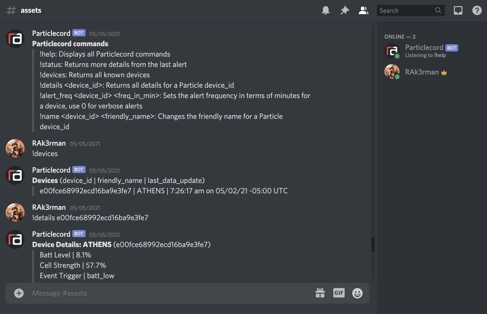

# Particlecord

A Discord notification bot that monitors Particle.io events using Node.js

## Purpose
Particlecord listens to the data stream from Particle.io devices and notifies the user when a particular event occurs.
Think of Particlecord as an "API middleman" that filters a real-time data stream from Particle.io and sends smart push notifications through Discord.
Devices can also be managed using the Discord bot by setting friendly names, changing alert frequencies, and outputting the status of any device.
Particlecord can also easily adapt to your project by modifying the API webhooks in app.js.

## Install
As easy as 1, 2, 3.
1. Clone the repo and enter the directory: ``git clone https://github.com/rak3rman/particlecord.git && cd particlecord``
2. Install packages: ``npm install``
2. Run project: ``npm run start``

## Usage
### Configuration
After the first run of particlecord, a config file will be created in the config folder with path ``/config.json``.
This file stores all the environment variables needed for the project, which can be edited when the instance is not running.
The config file will be populated with the following default values:
- ``"api_port": 3000`` Port where the api webserver will accept incoming connections, of type int
- ``"webhook_secret": "random_string_here"`` A random string generated server side for the Discord bot.
- ``"discord_bot_token": "random_string_generated_here"``
- ``"discord_bot_channel": "discord_channel_here"``
- ``"discord_bot_prefix": "!"`` The character that the Discord bot listens to. ! is the default, so !help will display the commands.

**NOTE:** Make sure to stop the instance of particlecord before changing any of these values. If the file is modified while an instance is active, the changes will be overridden.

### Running the project
The npm package supports multiple ways to run the project.
- ``npm run start`` Runs the project, plain and simple.
- ``npm run develop`` Starts the project and watches for all file changes. Restarts the instance if critical files are updated. Must have nodemon installed.
- ``npm run test`` Runs a few tests for Travis-CI. Nothing crazy here.

Use ``^C`` to exit any of these instances. Currently, there are no exit commands or words.

### Particlecord commands
- ``!help`` Displays all Particlecord commands
- ``!status`` Returns more details from the last alert
- ``!devices`` Returns all known devices
- ``!details <device_id>`` Returns all details for a Particle device_id
- ``!alert_freq <device_id> <freq_in_min>`` Sets the alert frequency in terms of minutes for a device, use 0 for verbose alerts
- ``!name <device_id> <friendly_name>`` Changes the friendly name for a Particle device_id

### Development
The framework behind this project is not new in the slightest. In fact, [many articles](https://www.section.io/engineering-education/discord-bot-node/) describe how to make a Discord bot using Node.js and explain the basics better than I can. If you'd like to make a Discord bot yourself I would highly suggest checking out these resources.

## Contributors
- **Radison Akerman** / Project Lead

*Individual contributions are listed on most functions*

## License
This project (particlecord) is protected by the Mozilla Public License 2.0 as disclosed in the [LICENSE](https://github.com/rak3rman/particlecord/blob/main/LICENSE). Adherence to the policies and terms listed is required.